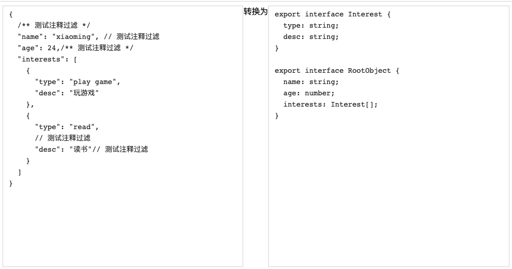

# 简介

将带注释的 json 数据，转为 ts 的接口类型。

可基于该项目拓展为 electron-app 版本的转换工具，也可以在上游接入 api 平台，将爬虫到的 json 数据批量转为 ts 类型。

## 特性

- json 转 ts 类型
- 自动过滤注释
- 可在线、动态编辑，实时生成 ts 类型

[点击预览](http://demian.wang/transform-json-to-ts/)
